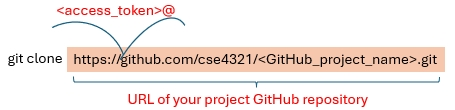

[](https://classroom.github.com/a/H3UUQjlQ)

### Project
Perform **control-flow testing** on a fault-seeded Java program, [**Printtokens.java**](./src/Printtokens.java).

[project slides](./project.summer.2025.pdf) | [project rubric](./rubric.pdf)

### Goals
- **Identify and fix faults** through testing.
- **Unit testing**: maximize **edge coverage** for all **non-main** methods.
- **End-to-end testing**: maximize **edge coverage** for **all methods** through the **main** method.


### Project Breakdown
**1** Test Case Preparation
  - Draw control flow graphs ([Video](https://youtu.be/lj7HY7ENU8Y)).
  - List test paths in the graphs ([Video](https://youtu.be/xfANxegQJnQ)).
  - Derive test cases from test paths ([Oracle](./oracle/Printtokens_Oracle.jar): provides the expected outputs for the given inputs).
   
    
**2** Testing
  - Write test methods based on test cases.  
  - Execute test methods and check execution status.
  - Fix faults when failures occur or after executing all test methods.
  - Update test methods (and test cases) and repeat the process if necessary.
  

  
**3** Reports
  - A list of identified faults and corrections.
  - One HTML coverage report for unit testing.
  - One HTML coverage report for end-to-end testing.

### Submission

- Check all the deliverables in the [project slides](./project.summer.2025.pdf).
- Put all the deliverables in Branch **main** in a folder "deliverables".
- Commit the changes before the deadline. 

<hr>

## Testing Support

### Requirements

- IDE: [Eclipse IDE](https://riyagoel192.medium.com/how-to-download-eclipse-java-ide-on-windows-52608032d6d9), [VS Code](https://code.visualstudio.com/download), or others.

- [Git](https://www.howtogeek.com/832083/how-to-install-git-on-windows/)

- [Java SE 16](https://www.oracle.com/java/technologies/javase/jdk16-archive-downloads.html) (Need to create an account to download. This version is tested and other versions may work.)

Note: Highly recommend to use Eclipse. However, you can use other IDEs. 

_ _ _ _ _ _ _ _

### Set up the Project Locally (Windows)

1 **Launch** a terminal.


2 **Clone** your GitHub project repository locally using the Terminal (with the main branch fetched).

  - Navigate to the directory for your project in the Terminal.
  
  - Prepare for the clone command.
  
    + **GitHub_project_name**: Name of your project GitHub repository.
    
    + **access_token**: [Personal access token](https://docs.github.com/en/authentication/keeping-your-account-and-data-secure/managing-your-personal-access-tokens#creating-a-personal-access-token-classic) of your GitHub account.
    
    + Clone command: 
    
    ```shell
    git clone https://<access_token>@github.com/cse4321/<GitHub_project_name>.git
    ```
    
    + An alternative to get clone command:   
	   
  
3  **Check out** the other branches to explore how to write test methods with command "git checkout branch-name".
  - **eclipse-eg-tests**: the branch containing an example program and test files based on Eclipse IDE.
  - **vsc-maven-eg-tests**: the branch containing an example program and test files based on VS Code.

4 **Create** your own branch to write your tests with your preferred IDE.

_ _ _ _ _ _ _ _


### Commit and Push Changes to GitHub Repository in the Terminal

**1**  Set up user info (if not configured).     
    
```shell
git config user.name "your GitHub account name"
git config user.email "your email" 
```

**2**  Stage all modified files.

```shell
git add .
``` 
**3**  Commit the changes.

```shell
git commit -m "commit message"
``` 
**4**  Push the changes to the main branch in the project repository in GitHub.

```shell
git push origin main
``` 


